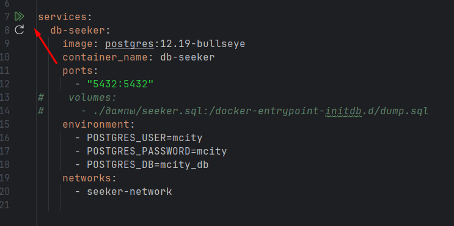

# Start:

Приложение ExcelSeeker - парсер xls\xlsx таблиц с данными в БД и выборкой данных из БД по запросу поисковой строки с веб-сайта.

## БД:
Docker для БД Postgres ставится из папки ```./seeker/docker-compose.yaml```


Далее к БД можно подключаться из приложения.

## Запуск приложения:
Через главный класс ```EventsApp```, как обычное приложение Java.
